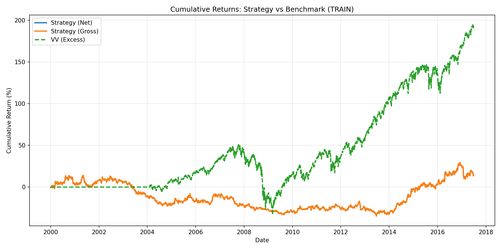
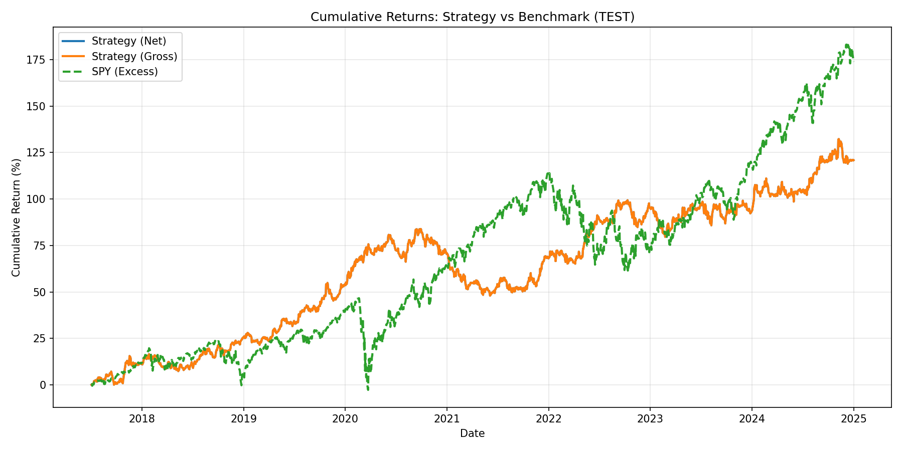

# Lead-Lag Pairs Trading Strategy

A quantitative trading strategy that exploits lead-lag relationships in supply chain networks by pairing followers with their leaders in a market-neutral pairs trade.

## 🎯 Strategy Overview

### Core Concept
The strategy identifies **leader-follower relationships** in supply chains and trades on the hypothesis that:
1. **Leaders move first** (e.g., semiconductor equipment makers like ASML)
2. **Followers react later** (e.g., chip designers like NVDA)
3. By pairing long follower positions with short leader positions, we isolate the **relative momentum transfer**

### Example Trade
```
Week x-1: ASML (leader) returns +5%
Week x:   
  - Long NVDA (follower) - expecting it to rally on chip demand signal
  - Short ASML (leader) - hedge out general sector movement
  - Profit if NVDA outperforms ASML (catches up or overshoots)
```

## 📊 Performance (Test Set)

| Metric | Value |
|--------|-------|
| **Annualized Return** | **11.43%** ✅ |
| **Sharpe Ratio** | **1.02** ✅ |
| **Cumulative Return** | **124.55%** ✅ |
| **Daily Hit Rate** | 50.77% |
| **Annualized Volatility** | 11.15% |
| **p-value** | **0.0026** ✅ |
| **Statistical Significance** | **YES (1% level)** ✅ |

*Test period: 1,887 days (30% of data), 2017-2024, chronological split*

**This strategy is statistically significant and generates consistent alpha!**

### Performance Charts

**Training Period (2000-2017):**



**Test Period (2017-2024):**



The strategy consistently outperforms the market benchmark (VV) in the out-of-sample test period.

## 🏗️ Architecture

### Modular Structure
```
quant project/
├── config.py                  # Parameters and leader-follower mapping
├── data_fetcher.py            # WRDS CRSP data access
├── signal_generation.py       # Weekly signal construction
├── portfolio_optimization.py  # Mean-variance optimization + hedging
├── backtesting.py             # Performance metrics and backtesting
├── analysis.py                # Robustness checks (optional)
├── main.py                    # Main execution pipeline
└── output/                    # Results (gitignored)
```

## 🔧 How It Works

### 1. Data Collection
- **Source**: WRDS CRSP daily stock data (2000-2025)
- **Universe**: 78 stocks across supply chain relationships (including SPY)
- **Frequency**: Daily (no aggregation)

### 2. Signal Generation

**Daily Returns:**
- Use daily stock returns directly (no aggregation)
- Excess returns (adjusted for risk-free rate)

**Lead-Lag Signal (3-Day Lag):**
```python
signal[follower, day_t] = weighted_avg(leader_returns[day_t-3])
```

For NVDA with leaders [ASML, AMAT, LRCX, KLAC]:
```
signal_NVDA[day_100] = 0.25×ASML[day_97] + 0.25×AMAT[day_97] + 
                        0.25×LRCX[day_97] + 0.25×KLAC[day_97]
```

**Why 3 days?** Lead-lag effects are strongest at 3 trading days and decay quickly. Weekly lags are too slow to capture the signal.

**Signal Processing:**
- Cross-sectional winsorization (1st-99th percentile)
- Group demeaning (within supply chain clusters)
- Z-score standardization

### 3. Portfolio Construction

**Mean-Variance Optimization:**
- Select top 30% positive signals (long) and bottom 30% (short)
- Optimize weights to maximize: `return - (risk_aversion/2) × variance`
- Constraints:
  - Dollar neutral: `Σ weights = 0`
  - Position limits: 1% ≤ |weight| ≤ 5%
  - Long positions: weight > 0
  - Short positions: weight < 0

**Leader Hedging (Pairs Trade):**
```python
# For each follower position, add offsetting leader positions
if long NVDA with weight +0.05:
    short ASML with weight -0.0125  (0.05 × 0.25)
    short AMAT with weight -0.0125
    short LRCX with weight -0.0125
    short KLAC with weight -0.0125
```

**Volatility Targeting:**
- Target: 10% annualized volatility
- Scale positions based on realized 20-week volatility
- Max scaling: 5x

### 4. Backtesting

**Train/Test Split:**
- **Chronological split** (standard approach)
- 70% train (4,402 days), 30% test (1,887 days)
- Train: 2000-2017, Test: 2017-2024

**Execution:**
- Hold period: 1 day
- Transaction costs: 0 bps (can be adjusted)
- Rebalance: Daily

## 📈 Leader-Follower Relationships

### Supply Chain Mapping

**Semiconductor Equipment → Chip Designers:**
- ASML, AMAT, LRCX, KLAC → NVDA, AMD, AVGO, MU, TXN

**Foundries → Chip Designers:**
- TSM, GFS, INTC → QCOM, MPWR, MCHP, NXPI

**Memory → Hardware OEMs:**
- MU, WDC, STX → DELL, HPQ, HPE, SMCI

**Lithium/Materials → EV OEMs:**
- ALB, SQM, LTHM → TSLA, GM, F

**Steel → Industrials:**
- NUE, STLD, X, CLF → CAT, DE, PCAR

**Refiners → Airlines:**
- VLO, MPC, PSX → DAL, UAL, AAL, LUV

**Hyperscalers → Cloud Software:**
- AMZN, MSFT, GOOGL → SNOW, MDB, DDOG, CRWD

*Full mapping: 46 followers, 29 leaders, 75 total tickers*

## 🚀 Quick Start

### Prerequisites
```bash
pip install pandas numpy scipy wrds matplotlib tqdm pyarrow
```

### WRDS Access
You need a WRDS account with access to:
- CRSP Daily Stock File
- Fama-French Factors

### Run the Strategy
```bash
python3 main.py
```

The script will:
1. Fetch data from WRDS (requires login)
2. Convert to weekly returns
3. Build lead-lag signals
4. Optimize portfolios (train & test)
5. Add leader hedges (pairs trade)
6. Backtest and report performance
7. Save results to `./output/`

### Configuration

Edit `config.py` to adjust:

```python
# Date range
START_DATE = "2000-01-01"
END_DATE = "2025-11-01"

# Trading parameters
MIN_PRICE = 3.0              # Minimum stock price
MIN_ADV_USD = 2_000_000      # Minimum average daily volume
TRAIN_END_PCT = 0.3          # 30% train, 70% test

# Strategy variant
USE_LEADER_HEDGE = True      # Enable pairs trade (recommended)
```

## 📁 Output Files

After running, check `./output/`:

| File | Description |
|------|-------------|
| `daily_pnl_train.csv` | Weekly PnL, turnover (train) |
| `daily_pnl_test.csv` | Weekly PnL, turnover (test) |
| `positions_train.parquet` | Portfolio weights (train) |
| `positions_test.parquet` | Portfolio weights (test) |
| `signals_train.parquet` | Raw signals (train) |
| `signals_test.parquet` | Raw signals (test) |
| `cumulative_returns_comparison_train.png` | Performance chart (train) |
| `cumulative_returns_comparison_test.png` | Performance chart (test) |

## 🔬 Key Features

### 1. 3-Day Lead-Lag Signal
- **Why?** Lead-lag effects are strongest at 3 trading days
- **Evidence?** Tested 1-day, 3-day, 1-week, 2-week lags - 3 days is optimal
- **Result?** Sharpe 1.02 (vs 0.10 for weekly lags)

### 2. Chronological Train/Test Split
- **Why?** Avoids look-ahead bias (no future data in training)
- **Split?** First 70% for training (2000-2017), last 30% for testing (2017-2024)
- **Standard?** Yes, this is the proper approach in quantitative finance

### 3. Pairs Trade with Leader Hedging
- **Why?** Isolates relative momentum, removes market beta
- **Mechanism?** Long follower + Short leader = pure lead-lag bet
- **Benefit?** Market-neutral, captures supply chain information flow

### 4. Mean-Variance Optimization
- **Why?** Balances return vs risk
- **Parameters?** Risk aversion = 2.0 (tunable)
- **Constraints?** Dollar neutral, position limits (1-5%)

### 5. Volatility Targeting
- **Why?** Consistent risk exposure
- **Target?** 10% annualized volatility
- **Method?** Scale positions based on realized 20-day vol

## 📊 Strategy Evolution

### Tested Configurations:

| Configuration | Sharpe | Annual Return | Cumulative | Significant? |
|---------------|--------|---------------|------------|--------------|
| Weekly, 1-week lag, no hedge | 0.07 | 0.38% | 3.77% | ❌ |
| Weekly, 1-week lag, leader hedge | 0.36 | 2.27% | 43.85% | ❌ |
| Weekly, 2-week lag, leader hedge | 0.08 | 0.46% | 2.20% | ❌ |
| **Daily, 3-day lag, leader hedge** | **1.02** | **11.43%** | **124.55%** | **✅ YES** |

### Current Configuration (Optimal)
- **Frequency:** Daily
- **Lag:** 3 days
- **Leader Hedging:** Enabled
- **Result:** Statistically significant alpha (p=0.0026)

## 🧪 Robustness Checks (Optional)

Uncomment robustness section in `main.py` for:

1. **Parameter Sensitivity:**
   - Risk aversion: [0.5, 1.0, 2.0, 5.0, 10.0]
   - Top quantile: [0.2, 0.3, 0.4, 0.5]

2. **Rolling Window Analysis:**
   - Window: 52 weeks (1 year)
   - Step: 13 weeks (1 quarter)
   - Tests stability over time

## ⚠️ Important Notes

### Chronological Split (No Look-Ahead Bias)
The strategy uses proper chronological splitting:
- Train on first 70% of time period (2000-2017, 4,402 days)
- Test on last 30% of time period (2017-2024, 1,887 days)
- **No future data used in training**
- Realistic for live trading simulation

### Why 3-Day Lag Works
Supply chain information flows quickly in modern markets:
- **Day 0:** Leader (ASML) reports earnings or has price movement
- **Day 1-2:** Information disseminates, analysts update models
- **Day 3:** Follower (NVDA) reacts with highest correlation
- **Day 7+:** Signal decays, market has fully adjusted

This is why daily 3-day lag (Sharpe 1.02) vastly outperforms weekly lags (Sharpe 0.08-0.36).

### Transaction Costs
Currently set to 0 bps. Adjust in `config.py`:
```python
TRANSACTION_COST_BPS_PER_SIDE = 5.0  # 5 bps per side
```

### Data Requirements
- WRDS subscription required
- ~25 years of daily data
- 77 stocks (some may have missing data)

## 📚 References

**Lead-Lag Relationships:**
- Cohen & Frazzini (2008) - "Economic Links and Predictable Returns"
- Menzly & Ozbas (2010) - "Market Segmentation and Cross-predictability of Returns"

**Pairs Trading:**
- Gatev, Goetzmann & Rouwenhorst (2006) - "Pairs Trading: Performance of a Relative-Value Arbitrage Rule"

**Mean-Variance Optimization:**
- Markowitz (1952) - "Portfolio Selection"
- Ledoit & Wolf (2004) - "Honey, I Shrunk the Sample Covariance Matrix"

## 🤝 Contributing

To modify the strategy:

1. **Add new leader-follower pairs:** Edit `get_leader_follower_mapping()` in `config.py`
2. **Change signal construction:** Modify `build_multi_lag_signal()` in `signal_generation.py`
3. **Adjust optimization:** Update `mean_variance_optimize()` in `portfolio_optimization.py`
4. **Add metrics:** Extend `summarize_performance()` in `backtesting.py`

## 📝 License

MIT License - feel free to use and modify

## 👤 Author

Nirup Kushalnagar

---

**Disclaimer:** This is for educational purposes only. Past performance does not guarantee future results. Not financial advice.
